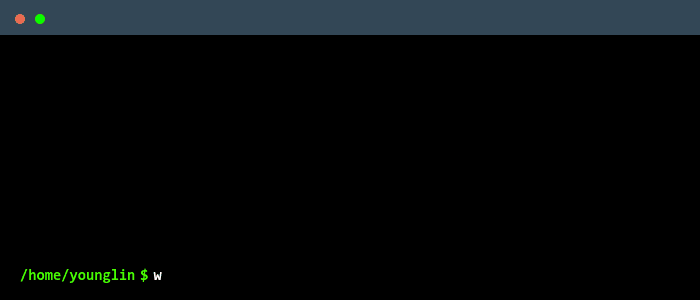

<!-- emojis: https://slackmojis.com/ -->
<h2> Hi, I'm Young Lin </h2>

<!-- gif: https://giphy.com/gifs/Smolverse-smol-smolverse-swol-JqmupuTVZYaQX5s094 -->

  <i>
    A senior at
    <a href="https://www.mis.yzu.edu.tw/?lang=en">Dept. of Information Management</a>,
    <a href="https://www.yzu.edu.tw/index.php/en-us/">Yuan Ze University</a>
     
    A member of Medical Informatics & Telemedicine Lab
    
  </i>

<!-- markdown-badges: https://github.com/Ileriayo/markdown-badges -->

<!-- github-readme-stats: https://github.com/anuraghazra/github-readme-stats -->
<!--  -->

<!-- github-readme-streak-stats: https://github.com/DenverCoder1/github-readme-streak-stats -->

<!-- terminal-gif-maker: https://www.terminalgif.com/ -->

<!-- readme-jokes: https://github.com/ABSphreak/readme-jokes -->

<!-- 
for more informations about making github readme profile:
1. https://github.com/rzashakeri/beautify-github-profile
2. https://github.com/abhisheknaiidu/awesome-github-profile-readme
3. https://zzetao.github.io/awesome-github-profile/
-->
